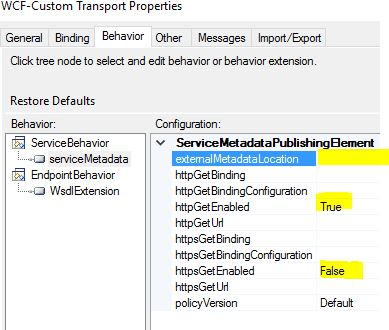
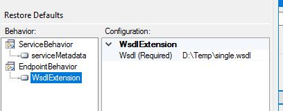

# WsdlExtension
**Dynamically add custom WSDL**

It is possible to add custom WSDL with the serviceMetadatEndpoint behaviour. But it needs to be hosted somewhere. That means that you still need something like IIS to host the wsdl file.

_You will still need the serviceMetadatEndpoint behaviour as you must set httpGetEnabled and/or httpsGetEnabled to true.__

With Wsdl extension you can point to a file instead of a URL for your BizTalk hosted HTTP endpoints. The Wsdl extension is applied as an EndpointBehaviour.

The Behaviour only has one property that is to be pointed to a file in a folder , preferably a network share.

The Wsdl file must contain a singlewsdl content, that includes xsd for the expected message(s).